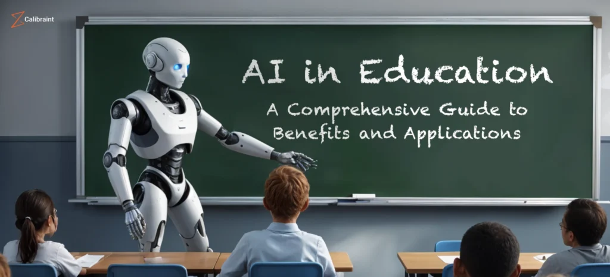

  
## The Presence of AI in my Education 

Throughout this course, AI has been a valuable tool in helping me better understand instructions, debug issues, and write clearer, more effective code. While several AI tools were available—such as GitHub Co-Pilot—I primarily relied on ChatGPT, as I was more familiar with how it worked and found it easier to use. ChatGPT provided helpful insights on how to make my code more efficient and readable, while also guiding me through the learning process itself. I often learned through trial and error, and used ChatGPT almost like a personal tutor—helping me identify bugs, understand error messages, and suggest fixes. It was especially useful for walking me step-by-step through errors I didn’t fully understand, allowing me to not only fix problems but also learn how to prevent them in the future.

## Personal Experience with AI 

During this course I felt as though it was important for me to try and figure issues out myself. I would make sure to sit down and work through errors and issues first before going to ChatGPT for help. 

### 1. Experience WODs
With many WODs I was able to refer back to old work and assignements to complete them while using ChatGPT as a tool to debug. In E18 I was struggling with how to generate a dropdown menu. ChatGPT assisted me in coding it then I went back in to make tweaks and edits with how I needed it to work.

### 2. Practice WODs
For practice WODs I made sure to attempt them multiple times until I felt comfortable doing it myself. With the time constraint attached to these WODs it wasn't beneficial to use AI. The only time I would use it was towards the end to make readability better and with help correcting any ESLint errors.

### 3. Test WODs
AI use wasn’t practical during timed WODs. I relied on memory and intuition, which helped me solidify concepts rather than depend on tools. AI was used as a took for readability same as my practice WODs.

### 4. Essays
Essays were written with my own thoughts and explanations. ChatGPT was used for grammar checks and restructuring of paragraphs. It was extremely helpful with the brainstorming process by giving me new ideas on what would be intresting to write about

### 5. Final Project
I used ChatGPT as a frequent tool to help with debugging. For example when my group members were getting error messages from Vercel I asked ChatGPT "what does this error mean and how do we fix it." Chat then assisted me in finding a solution so my group members were able to complete their parts accordingly.

### 6. Learning a concept / tutorial
When learning more about Vercel and how to connect it ChatGPT was a great teacher in walking me through the steps and the neccessary things I needed to setup in order to get it running. After its help I was able to fix our site and get it to deploy.

### 7. Answering a question in Discord
For answering questions in Discord I didn't use AI. I would only answer questions I knew how to answer or if I had helpful information to share.

### 8. Asking or asnwers a smart-question
All the questions and answers I gave to smart-questions were my own. I didn't use the help of AI to formulate questions or answers.

### 9. Coding Examples
I used ChatGPT to generate examples of what good code would look like for certain WODs. It then gave me a snippet which was helpful to refer to for syntax review.

### 10. Explaining Code
ChatGPT was extremely helpful in explaining code especially when it was for a practice WOD or tutorial. Sometimes the instructions were vague so it would explain what the code snippets were doing and how it affected the project as a whole.

### 11. Writing Code
I used AI to scaffold out functions like the 'AddNoteForm' in our final project. It gave me a structure, but I still had to customize it heavily for the database schema. It was helpful when needing to write code as it would give me a skeleton to work with then I could go back in adn heavily edit to make it what I needed.

### 12. Documenting Code
ChatGPT provided me with good ways to document code when needed. It gave me helpful notes when writing code so I could come back to it in future projects and edit when needed.

### 13. Quality Assurance
For debugging ESLint errors, I pasted the error and code into ChatGPT and asked: 'Fix this ESLint error: no-unused-vars in Next.js.' It was a quick way to learn lint rules. It helped in future assignements as I could fix the errors myself with no help.

### 14. Other uses in ICS 314 not listed
I used AI to understand how to deploy using Vercel and handle environment variables. Prompt: 'What is a .env file and how does Vercel handle environment variables?

## Impact on Learning and Understanding 

AI was tremendously helpful in understanding and resolving errors in my code. There were many times when I felt frustrated trying to debug projects on my own, and having a tool like ChatGPT to walk me through errors and explain them clearly made a huge difference. It didn’t just help me fix issues in the moment—it also taught me how to recognize similar problems in the future and apply the solutions on my own. For example, during our Vercel deployments, I encountered multiple build errors that I didn’t initially understand. ChatGPT helped me break down those errors, explaining why they were happening and guiding me through the steps to resolve them. Later, I was even able to assist my group members when they ran into similar issues. While ChatGPT wasn’t perfect—sometimes offering outdated or incomplete advice—it was an incredibly valuable learning companion that made this course more manageable and less overwhelming.

## Practical Applications 

Outside of ICS 314, I’ve used AI tools like ChatGPT in real-world coding projects and business-related tasks. For instance, in my Hakulei by Kay floral business, I’ve used ChatGPT to help write product descriptions, format invoices, and create functional pages for a business website. The same coding strategies I used in ICS 314 carried over—for example, using React components, Bootstrap styling, and form validation techniques. AI helped streamline the process by quickly generating reusable UI patterns and explaining how to adjust them. 

## Challenges and Opportunities 

While AI was helpful, it also came with challenges. One of the biggest was learning to identify when AI responses were incorrect or outdated. ChatGPT sometimes gave solutions that didn’t apply to the version of Next.js or Prisma we were using, which led to confusion or wasted time if I didn’t double-check the documentation. I also noticed that relying on AI too much could become a crutch if I wasn’t careful. I had to balance using AI as a learning aid versus letting it do too much of the work. However, these challenges also presented opportunities. I became better at asking specific, well-structured prompts and learned how to cross-reference answers with official sources. 

## Comparative Analysis 

When comparing traditional teaching methods with AI-enhanced approaches, it’s clear that both have their strengths—and together, they offer a more complete learning experience. Traditional methods, like lectures, walkthroughs, and documentation, helped lay the foundation for key concepts in software engineering. These methods encourage deeper thinking, personal accountability, and a stronger memory for syntax and structure. However, traditional learning can be slow, especially when students get stuck and can’t immediately access help. That’s where AI tools like ChatGPT made a difference. AI provided instant feedback, examples on demand, and explanations tailored to my specific issue, which helped me move forward without waiting for outside assistance. That said, AI sometimes lacked the context or accuracy of a professor or textbook, which means its output still required critical evaluation. In my experience, the most effective learning happened when I used both—traditional instruction for understanding, and AI to accelerate and reinforce that learning through real-time support.

## Future Consideration 

Looking ahead, I believe AI will play an even larger role in software engineering education. As tools like ChatGPT and Co-Pilot become more integrated into development environments, students will be able to receive smarter, more contextual assistance right inside their IDEs. We may also see AI being used to automatically assess code quality, generate feedback on projects, or simulate peer code reviews, which could drastically improve learning efficiency. However, I also think it’s important to teach students how to use AI responsibly, not just to copy and paste code, but to analyze, question, and adapt it. Courses could incorporate AI-specific modules that teach prompt engineering, critical analysis of AI output, and the ethics of using generated code. AI will continue to grow in power, but how we teach students to interact with it will determine whether it enhances education or replaces learning. Used wisely, it has the potential to make software engineering more approachable and engaging for everyone.

## Conclusion 

Reflecting on my experience with AI in ICS 314, I can confidently say that it made a meaningful impact on my learning journey. AI tools like ChatGPT provided me with quick, accessible guidance that helped me understand errors, explore new coding concepts, and work more efficiently on both assignments and my final project. At the same time, I learned that AI is not a shortcut—it’s a supplement. I still had to put in the effort to understand the material, test solutions, and refine my code. The combination of traditional teaching and AI-enhanced support created a balanced environment where I could grow as a developer while gaining real-world skills. As AI continues to evolve, I hope future courses will embrace it not just as a tool, but as a learning partner—one that supports curiosity, independence, and deeper understanding in the field of software engineering.

## AI Usage Reflection 

AI tools were used only for grammar, punctuation, and readability suggestions. All ideas, reflections, and writing are entirely my own.
