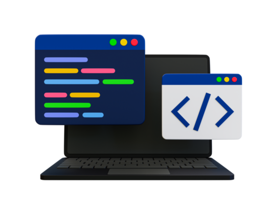

## Opinons on Typescript 

TypeScript has been a surprisingly powerful tool in my development journey. Although I didn’t have much experience with it before, learning how to use it has been both challenging and rewarding. One of the biggest benefits I noticed is how effectively it catches bugs early, even before running the code. Using the TypeScript playground, I was able to quickly spot and fix issues, which made debugging much smoother. It also generates outputs quickly, which helps confirm whether my code is working as expected. While getting familiar with TypeScript, I also had to dive into Java—a bit tricky at first—but the introduction modules really helped solidify my understanding. Overall, TypeScript has proven itself as a helpful and efficient language that I now recommend more often.

## Comparison to other languages 

Compared to other programming languages I've used, TypeScript feels more technical and complex. It relies on JavaScript but adds stricter typing, which makes it more structured than languages like Python. While Python is straightforward and beginner-friendly, TypeScript demands more attention to detail. I’ve also worked with C, which I find the most challenging due to its lower-level syntax. That said, TypeScript stands out for its speed and responsiveness, especially when producing outputs and detecting bugs. I really value that efficiency. Still, if I were choosing a first language to start with, I might go with something simpler. But for more advanced or scalable projects, TypeScript is a strong contender.

## Should Typescript be used as a software engineer? 

From a software engineering perspective, TypeScript is incredibly useful for creating scalable and maintainable systems. Through my research and personal experience, I’ve learned that its static typing system helps catch bugs during compile time—long before runtime errors appear. That kind of early detection is a major asset in professional development. TypeScript also supports large-scale collaboration with features like interfaces and modular design. Engineers can confidently build and update code without fear of breaking everything. Personally, I appreciate how well it integrates with tools like VS Code, which I use frequently because of its clean and user-friendly interface.

## WODs 

The WODs (Workouts of the Day) have been one of my favorite parts of the learning process. I’m someone who retains information best through hands-on practice, and these assignments let me do just that. After reviewing the modules and lessons, I can apply the concepts directly to the WODs, which reinforces my learning. I also appreciate the video demonstrations at the end—they give me clear examples of what to improve on or confirm that I’m on the right track. The short length of WODs is another plus. Unlike longer assignments that can take days and leave me feeling frustrated, WODs are quick and manageable. If I make a mistake, I can usually fix it within minutes.

## Learning Style 

I really enjoy the asynchronous format of this course. It allows me to fit school around everything else I have going on in life. As someone who thrives on organization and independence, I find this structure empowering rather than overwhelming. I’m able to stay on track and complete work on my own schedule without the added pressure of live class sessions. That flexibility has reduced my stress and helped me focus more on actually understanding the material rather than just keeping up. 

## AI Usage Reflection 

AI tools were used only for grammar and punctuation suggestions. All ideas, reflections, and writing are entirely my own.
